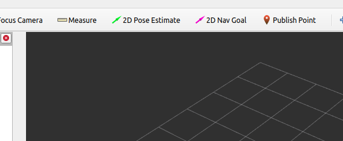

## Requirements

- The delivery vehicle
- A portable monitor
- A portable power supply (used to power the screen)
- A mouse and keyboard
- ROS (tested on Noetic)
- The full `outdoor-arm` package, in the home directory of the delivery vehicle
- The corrected map files
- Waypoint and route graph files

# How to setup a delivery run

Plug in the mouse, keyboard and screen to the delivery vehicle. You can safely close the programs which start automatically. Before starting a run you need to transfer the relevant files to the vehicle. These include the corrected map files, waypoints and route graph information.

- The `ground.pcd`, `pts_map.pcd`, `non_ground.pcd`, `map_config.yaml` and `waypoints.csv` files should be placed in `~/outdoor-arm/src/data/current_map`
- The `route_graph.json`  and `waypoints.csv` need to be in `~/outdoor-arm/src/data/route_delivery/route1`

To begin the run open a new terminal and run `roscore`. In a second terminal, execute

```
cd ~/outdoor-arm
source devel/setup.bash
cd src/scripts    
./delivery.sh
```

while having a third terminal open to run

```
cd ~/outdoor-arm 
source devel/setup.bash
rosservice call /deliver_routing_node/routing_delivery {“id_list:[‘10000’,‘10001’]”}
```

The vehicle will not start moving yet, as there is uncertainty in the starting point. You should already see the waypoints in the `rviz` graphical display launched by the delivery program. There will be a response in the terminal too, indicating whether a plan could be constructed. Select "2D Pose Estimate" in the menu bar at the top of the screen. You can then select the starting point of the route, which usually corresponds to one of the displayed waypoints.



Note that the vehicle will follow waypoints until the delivery point. To return back to the starting point when delivery and starting points are distinct, change the node order when sending a request to the planner (where you may have to increment the id further than `10001` to match the id of the node you previously sent the vehicle to).

```
cd ~/outdoor-arm 
source devel/setup.bash
rosservice call /deliver_routing_node/routing_delivery {“id_list:[‘10001’,‘10000’]”}
```
