## Requirements

- ROS (tested on Noetic)
- The corrected (and merged) point cloud files
- The route graph configuration file to edit
- The full `outdoor-arm` package, in the home directory of your local machine

### Add route/Add and configure delivery point 

The composition of the delivery is formed by the collected route and the coordinates of the delivery point. We need to put the data collected below into it according to the following rules.   

Before recording, you need to open the code. The opening code is:   

```
cd ~/outdoor-arm 
code .
```

The following figure depicts the relationship between the parameters. The following figure shows the departure and return routes. The file `way_1.csv` is the departure route, and way `way_1r.csv` outlines the return route. Both will pass through the specified nodes (which can be identified as delivery points).

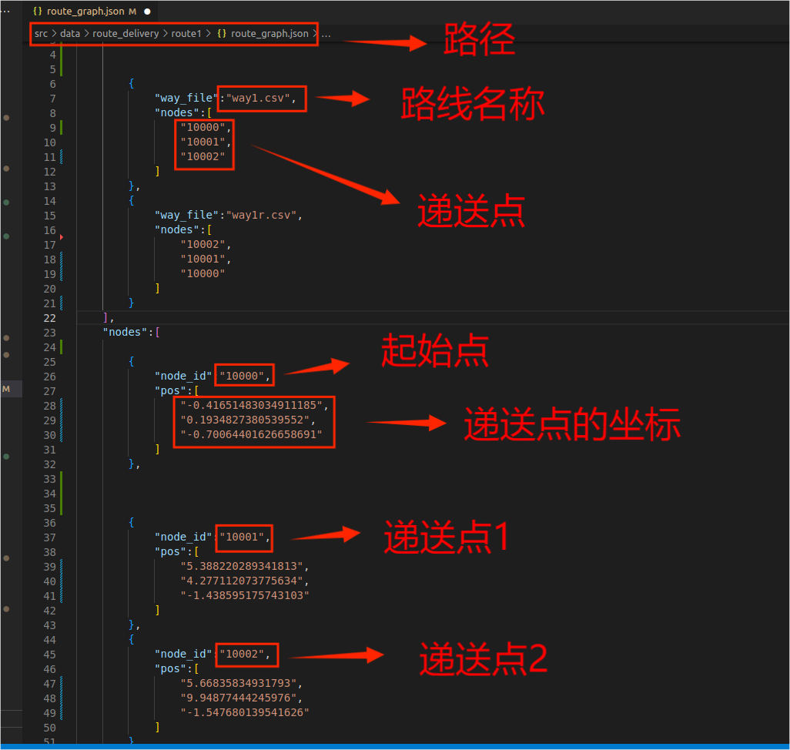

Draw the route and open the following URL 

https://tools.tier4.jp/ 

Select the version inside the red box 

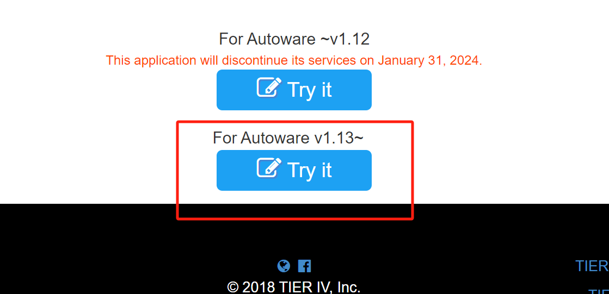

Select "Import PCD", and then select the file.

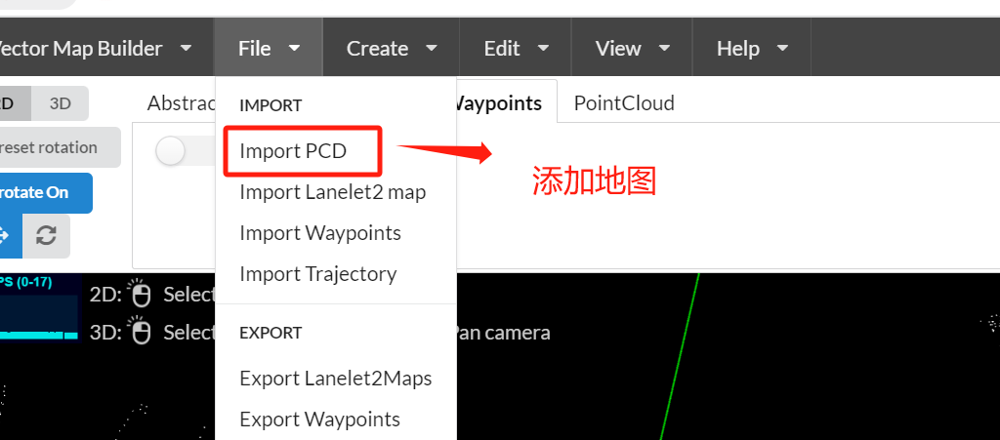
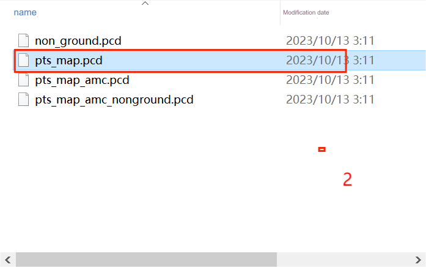

Add road network as follows.

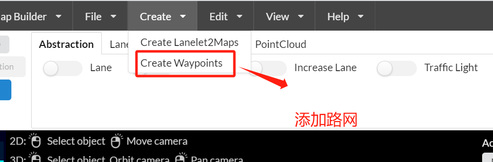

Start adding route, with the following waypoint parameters.

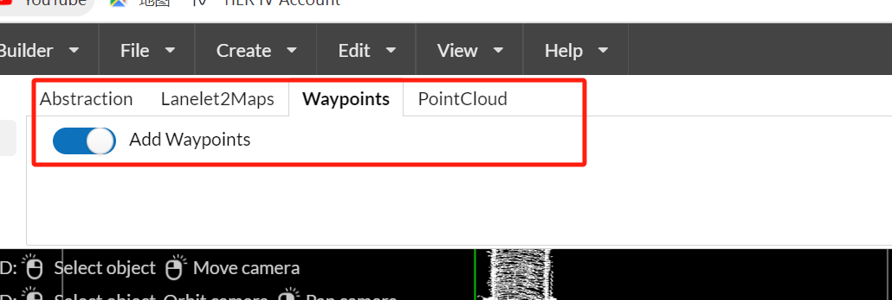
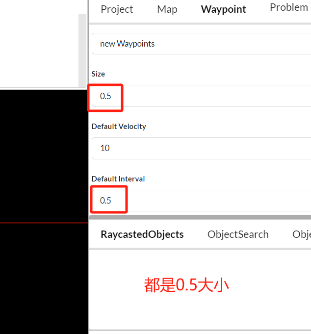

Define a starting point and click (Ctrl+Z to return to the previous step) to plan the route. When drawing the route, both the starting and returning routes must pass through delivery points, that is, starting and returning on the same route. 

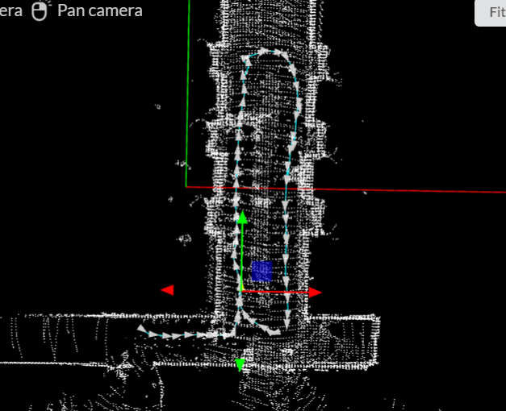

Configure delivery points 

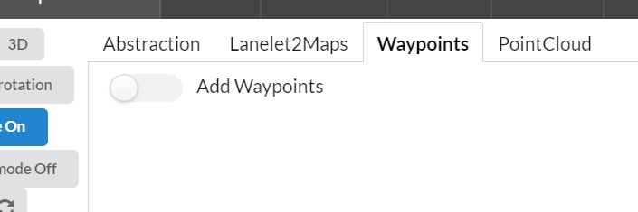

Find the point to be used as a delivery point in the route, click on the bottom right corner, and the coordinates of the point will appear.

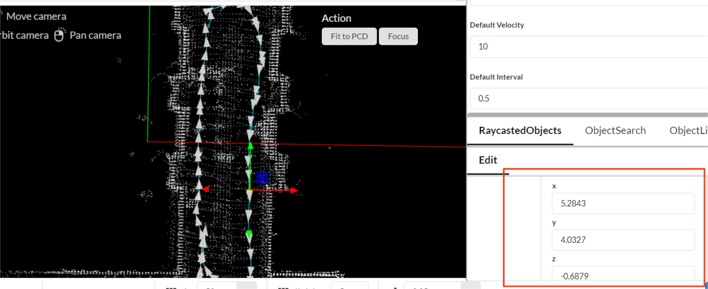

Then put the coordinate data of x, y and z in the following figure. The object entry indexed by `10000` is the starting point, and the following entries are the delivery point (Ctrl+S after configuration) 

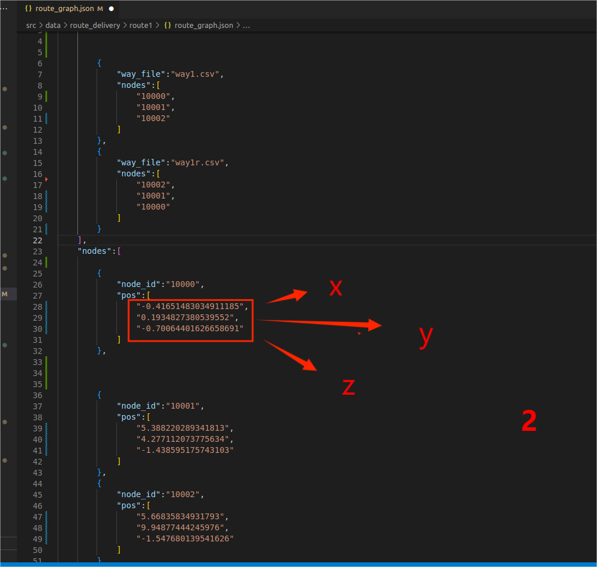

After planning the route, save it 


After saving, put the file in the delivery vehicle `~/outdoor-arm/src/data/route_delivery/route1` file as the route.

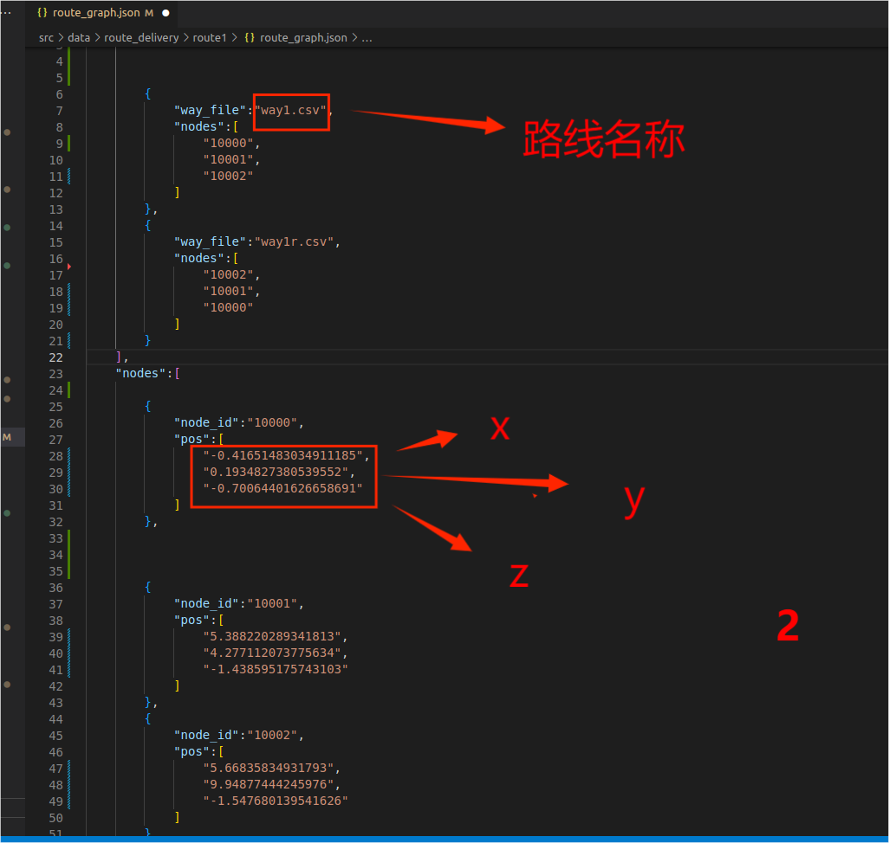

After planning the route, you can run from the starting point to the first delivery point point in manual mode. The code is as follows.    

```
roscore
```

Second terminal, start the main program 

```
cd ~/outdoor-arm
source devel/setup.bash
cd src/scripts
./delivery.sh
```

The third terminal is the manual delivery point. 

```
cd ~/outdoor-arm    
source devel/setup.bash
rosservice call /deliver_routing_node/routing_delivery {“id_list:[‘10000’,‘10001’]”} 
```

The delivery vehicle runs from the starting point to the first delivery point. As shown in the figure below, the returned data is   

`valid:true`

If the return data is `valid: false`, this is an error. If there is an error, check whether there is a road network on `rviz`. If there is no road network, it proves that the route is not correct. Then check whether there is a problem with the connectivity of the road. If the delivery point is not on the route, check the route of the `.json` file again. Check whether the coordinate point is wrong. Check whether the code is typed incorrectly.
