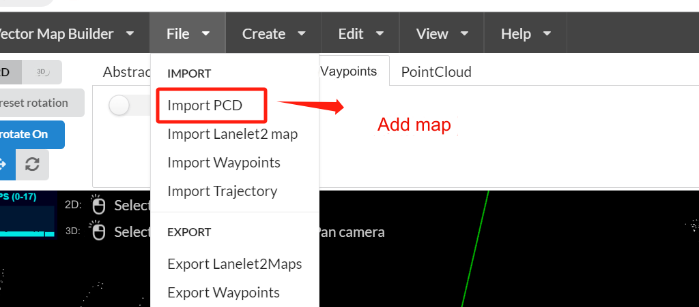
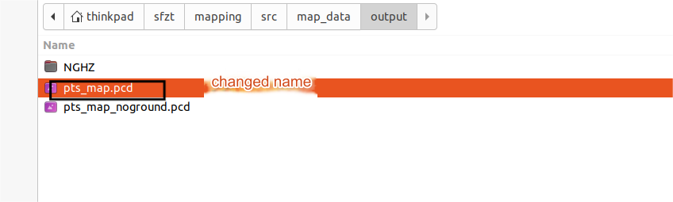
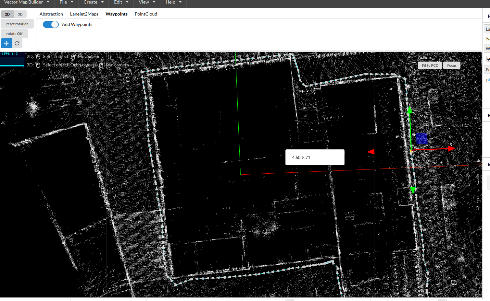
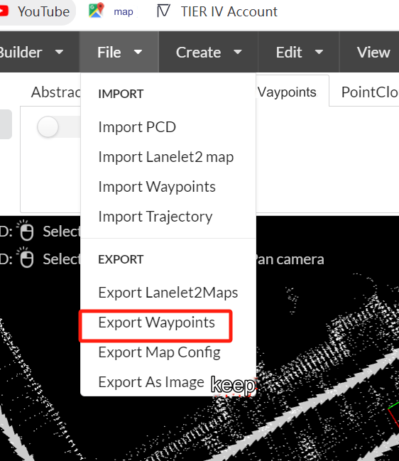
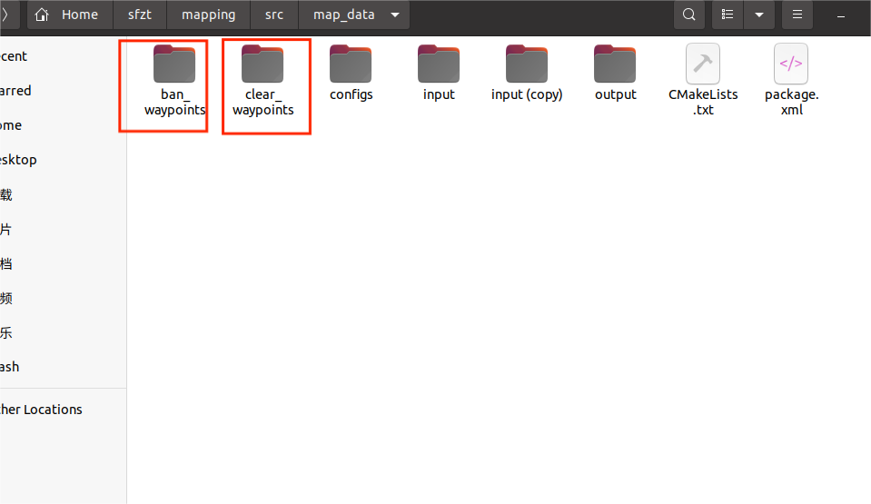
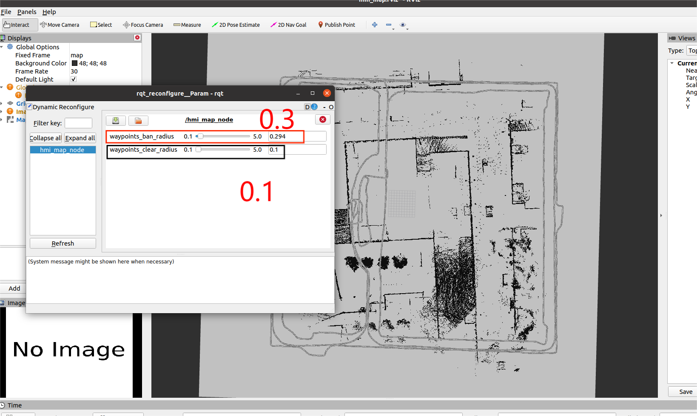
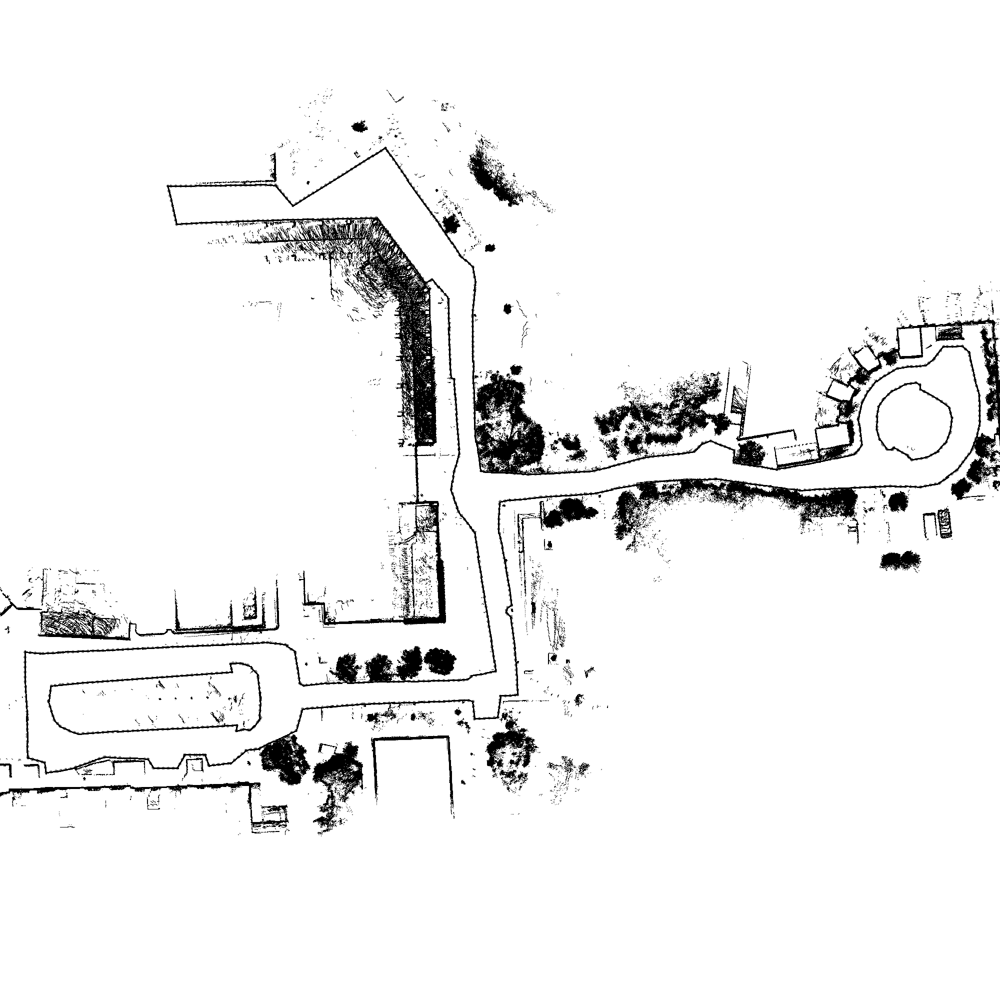

## Requirements

- ROS (tested on Noetic)
- The `sf-mapping` package in the home directory
- The corrected (and merged) point cloud files

## Prohibited area for map on the web page 

The radar cannot scan very low places, such as pits, steps, ditch areas, and road steps, so it is necessary to draw a forbidden zone. When drawing a prohibited area, if there are multiple prohibited areas, you can draw multiple prohibited areas and draw multiple routes of the prohibited area, and export them in turn and put them in the directory of `~/sf-mapping/src/map_data/ban_waypoints` and `clear_waypoints` of the prohibited area. 

First open the following URL 

https://tools.tier4.jp/ 

Select the version inside the red box 


Click on "Import PCD" and select the pointcloud files




Add road network 


Start drawing the forbidden area. The following figure is just an example, subject to the actual map (Ctrl + Z is to return to the previous step). 



Save and export after mapping 



Export them separately and place them in the `~/sf-mapping/src/map_data/ban_waypoints` and `clear_waypoints` directories. 



Terminal input 

```
cd ~/sf-mapping/ 
source devle/setup.bash 
roslaunch staticmap staticmap_update.launch
```

After opening, adjust the parameters. The recommended `waypoints_ban_radius` parameter is 0.3, and the recommended `waypoints_clear_radius` parameter is 0.1. After adjusting the Shift+S save, you can see the save address in the terminal. The saved path is in `sf-mapping/src/map_data/out`. Use image editing to modify it. Draw the lines in the prohibited area black, erase all clutter in the passage area, and ensure blank space. After the operation, place the 2d area in the delivery `~/outdoor-arm/src/data/current_map` file for use. The following figure is just an example, please refer to the actual map for details.



The effect is as follows: the black line represents the passage area, while the communication area is blank, without leaving any clutter or lines. 


