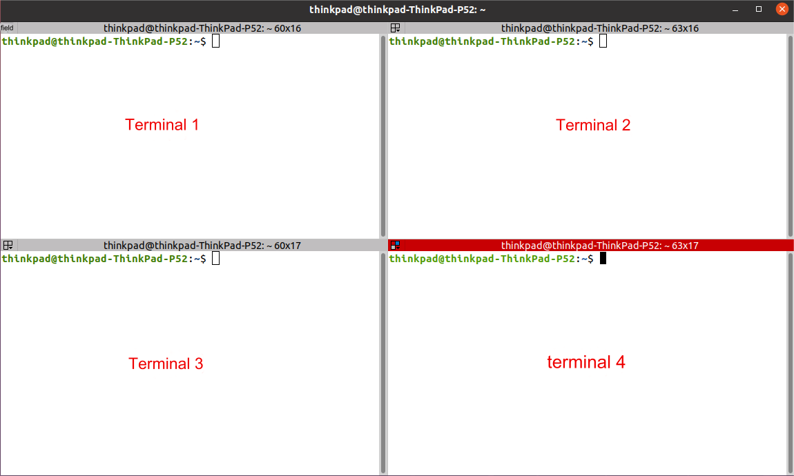
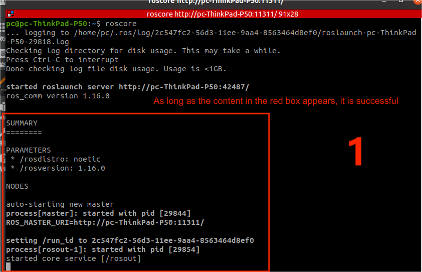
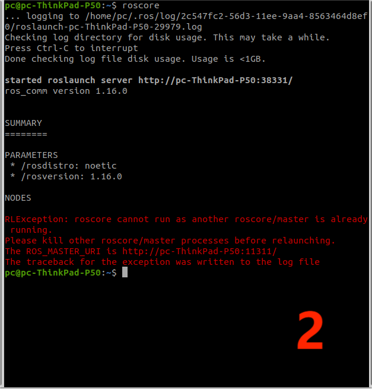
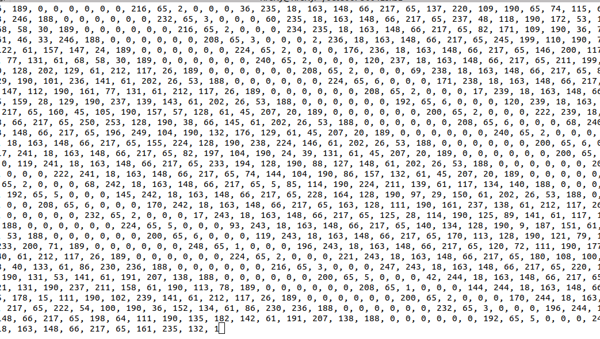
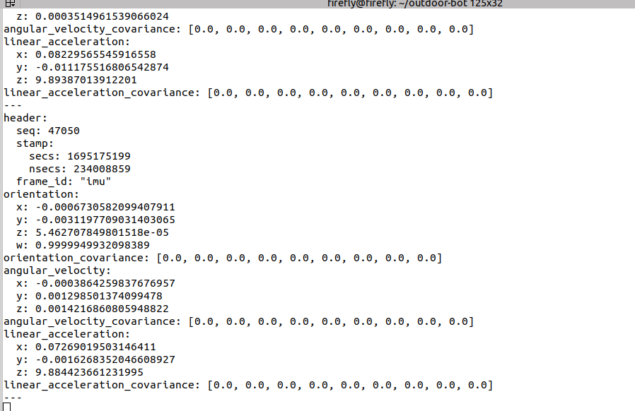
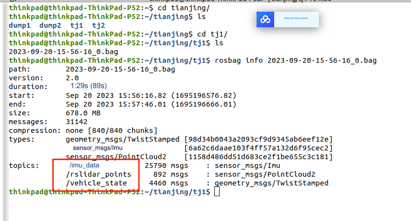

## Requirements

- The delivery vehicle
- ROS (tested on Noetic)
- The full `outdoor-arm` package, in the home directory of the delivery vehicle

## Operation Instructions for Map Data Collection of Delivery Vehicle 

After the delivery vehicle is turned on, some programs will be started (self-starting). We need to turn them off every time we build a map. We can't turn them off by clicking X, so We need to press Ctrl + C to turn them off. The package for creating the map is in the `~/outboor-arm/src/scripts` directory in the folder, and the file name ending with .bag is the data package generated by collecting the map.   

First, we need to collect the data packet of the map, open the terminal (right click to open the terminal) or (shortcut key Ctrl + Alt + T).   

There are three ways to open a terminal after you open the first terminal:   

- Right click to open the terminal;   
- Shortcut key to open;   
- Place the mouse in the terminal box and right click to select Split Horizontally or Split Vertically. The effect is shown in the following figure. 



Input `roscore` to start the first terminal. As long as it is not shut down in all the following uses, it only needs to be started once. If it fails to start, it means that it has been started. Refer to Figure 1 for successful start and Figure 2 for failed start




The second terminal enters the main program to start with the following command 

```
cd ~/outdoor-arm
source devel/setup.bash 
cd src/scripts
./amc_start.sh 
```

When the main program starts, it is necessary to check whether the radar and IMU data of the delivery vehicle are normal. Open a new terminal and enter the following command to check the radar: 

```
cd ~/outdoor-arm 
source devel/setup.bash 
rostopic echo /rslidar_points  
```

If the radar has data, it is normal. After checking, Ctrl + C is required to close it. In the figure below the radar is normal.



Open a new terminal and enter the following command to check the IMU: 

```
cd ~/outdoor-arm 
source devel/setup.bash 
rostopic echo /imu_data
```  

If the IMU has data, data will appear as in the following figure. Ctrl + C is required to close it after checking.



After starting the main program, start the program for collecting the map data packet at the third terminal. First define a starting point and an end point, start the program at the starting point, end the program at the end point, end operation: Ctrl + C, and end the program.  

The command is as follows 

```
cd ~/outdoor-arm 
source devel/setup.bash 
cd src/scripts
./record.sh
```

Before mapping, it is necessary to collect a short map data packet to check whether there is recorded data and whether it is stored in the corresponding folder, so as to prevent recording empty packets.   

There are two ways to check for empty packets:   

- Check whether there is a package ending with .bag in the `~/outboor-arm/src/scripts` directory under the file. If there is no package, the recording fails.    
- Open the terminal input.   

```
cd ~/outdoor-arm 
cd "the path into this packet"
rosbag info "packet name"
```

If the red box in the following figure appears, it means that the acquisition is successful.



Default path of data package: in the folder `~/outboor-arm/src/scripts` with `.bag` at the end of all file names is the data package collected this time.   

After the above program is used up, if it is no longer used, you need to use Ctrl + C to close it. All the following programs are the same. If you do not need to use them, you can use Ctrl + C to close them. 