## Requirements

- ROS (tested on Noetic)
- The `sf-mapping` package in the home directory

## Generate Map 

After editing the map, the dump package folder should be backed up separately. The automatically generated `/tmp/dump` folder is a temporary folder, which will be automatically deleted after the robot restarts. 

Open on the first terminal

```
roscore 
```

Start at the second terminal and enter the following commands. We set `use_sim_time` so that the mapping node uses the time published in `/clock`.

```
cd ~/sf-mapping
source devel/setup.bash 
rosparam set use_sim_time true
roslaunch lego_loam_bor large_hd_mapping.launch 
```

Third terminal 

``` 
rosbag play "path to bag" --clock -r 5
```

Close the second terminal program after the drawing is created, and the saved address will appear after the terminal program is closed. 

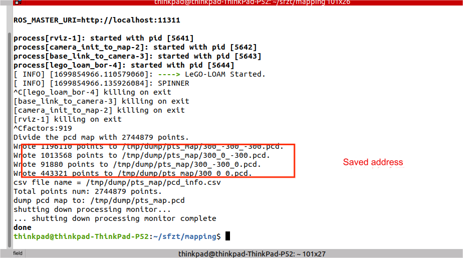

## Correcting map operations  

Start map editing software  

```
cd ~/sf-mapping
source devel/setup.bash 
rosrun interactive_slam interactive_slam
```

Open the software and put the map that needs to be modified into the software. 

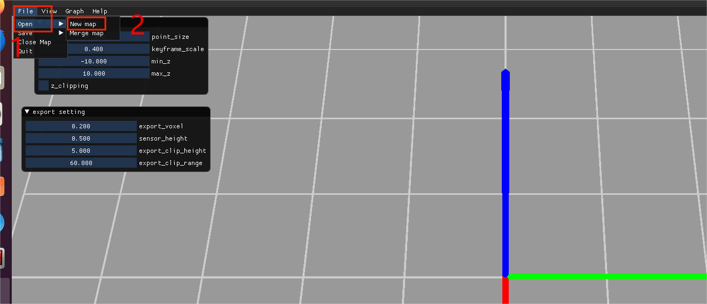
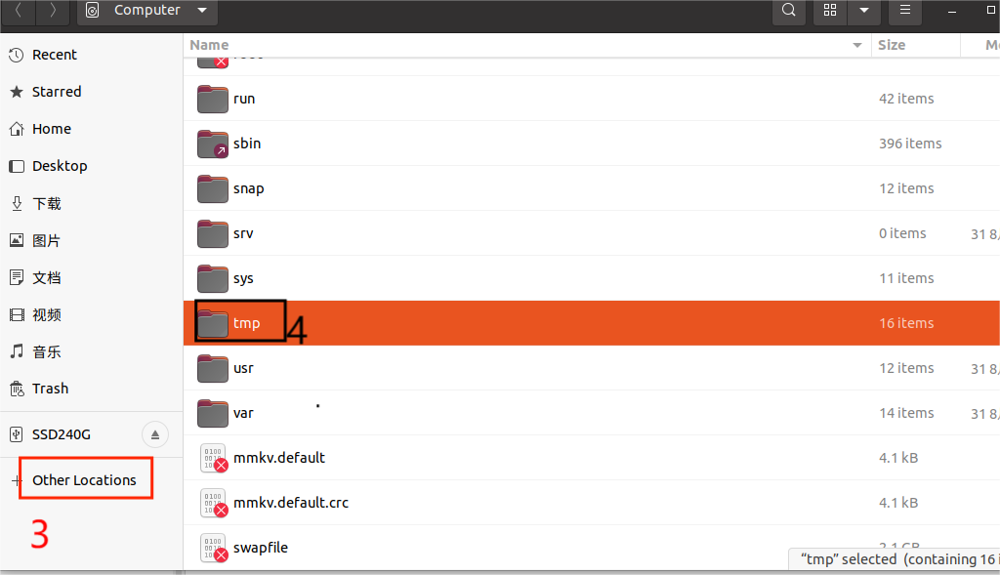
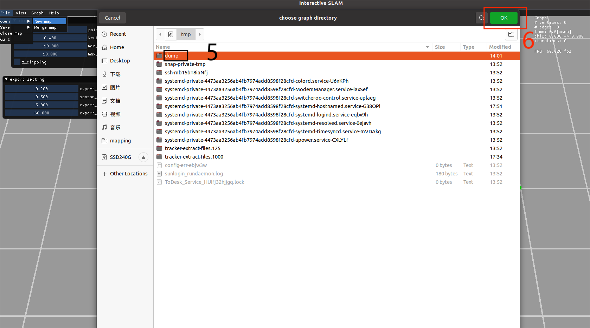


After opening, you can edit the map. Open the following tool before editing the map: Graph→Graph editor 

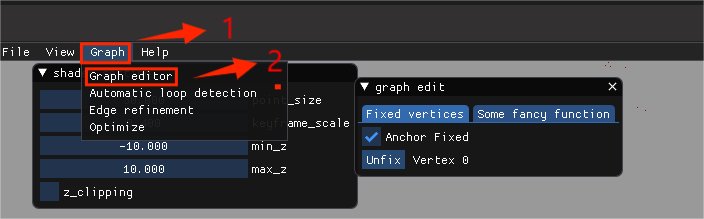

First check the map to find the location of the ghost. These are apparent point clouds of objects that do not exist, or point clouds of real objects in the wrong location or orientation (compared to their real-world position and orientation). The following commands help navigate around the scene.

- Press and hold the left mouse button: 360 ° view;   
- Mouse wheel: zooming in and out;   
- Press and hold the mouse wheel: move the plane;   

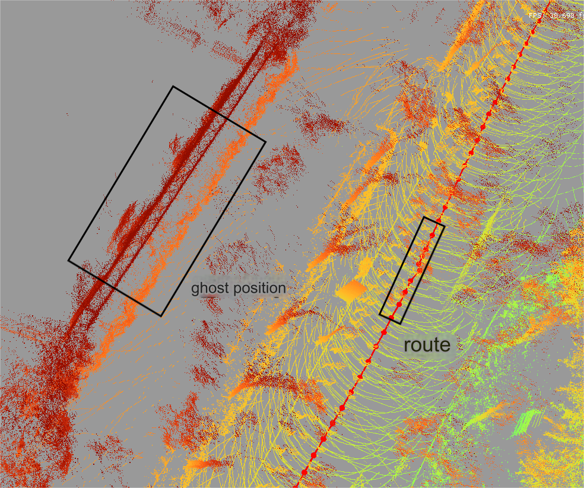

Select the point in the route of the ghost range with the left mouse button, click the right button to select "Loop begin" to view the map scanned by the radar, find out the ghost point, and then correct it by comparing with the previous correct point. Select the correct point with the left mouse button and click "Loop begin" with the right mouse button.   

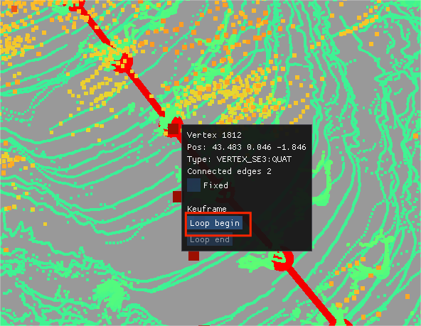

Select the point where ghosting appears, right-click on "Loop end" 

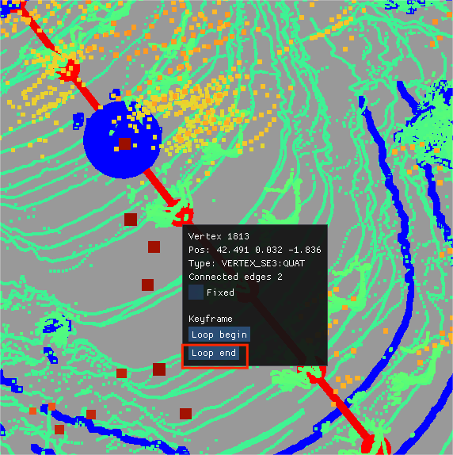

The following interface appears. Click "Scan matching", and then view the effect after merging in the box. If the effect is not good, or the ghost is bigger,click the cancel button, and then go to correct other points. If the effect is good, do the following. 

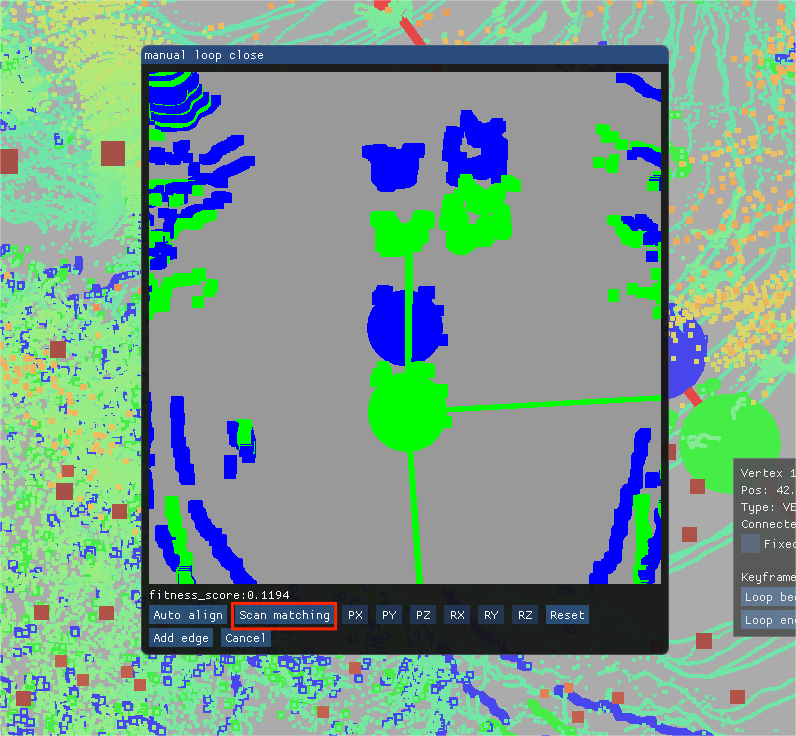

Click OK on the interface shown below, then click "Add edge" to execute, and the operation is complete. 

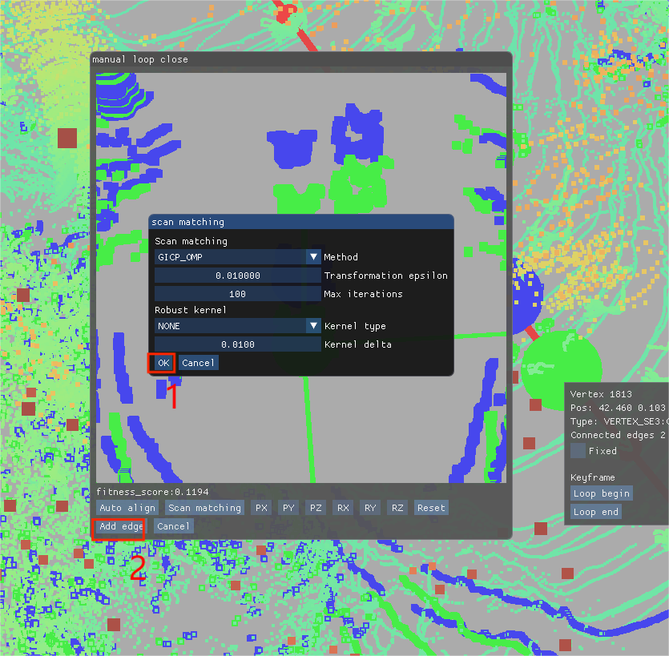

For map loop closure and when merging maps, use scan matching to correct. The points used should be close together. Ideal candidates for this operation are points seperated by an unexplained jump in coordinates, and matching the observed point clouds can help correct drifts in odometry. You may need to use the technique on a series of adjacent points. Firstly, click on the starting point with the left mouse button, then right-click to mark "Fixed" with a √ and click on "Loop begin". 

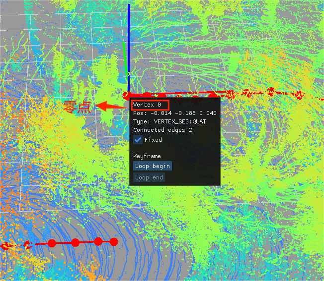

Find the point to overlap, select with the left mouse button, right-click to open and select "Loop end", and the following interface will appear. 

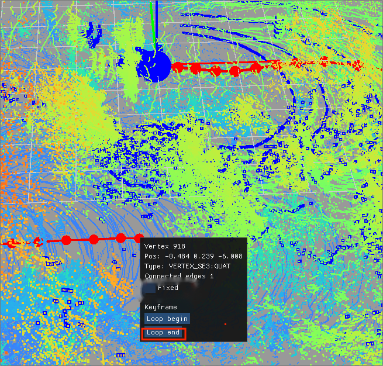

First, click on the "Auto align" interface and click OK. Then, click on Scan matching, click OK, and finally click on the "Add edge" application. 

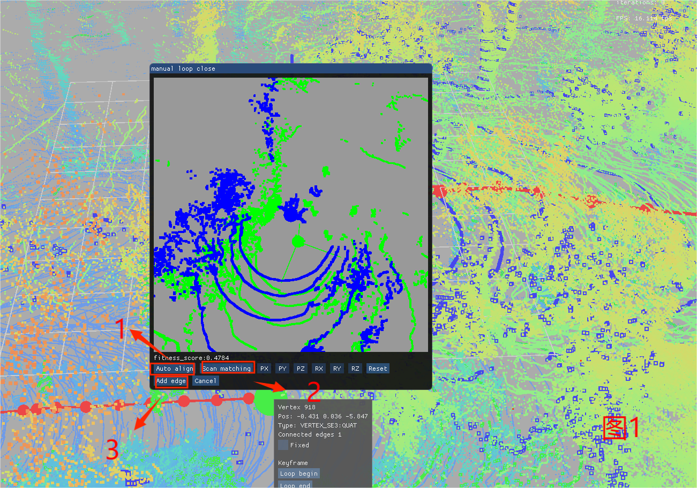

You can click "Unfix" to clear previously added constraints. If multiple scan matching steps are not yielding a consistent map, you may need to loosen the fixed constraint on some points to allow the program greater flexbility in correcting the map.

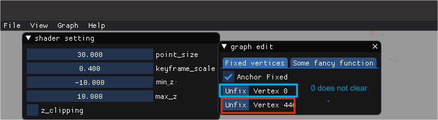

After editing the map, save it: click File→Save→Save map data and save it to a custom folder. This format allows re-importing to the program and merging with another map fragment later on. If the map is already complete, select "Export ALL PCD" instead, and skip the documentation for merging map fragments.

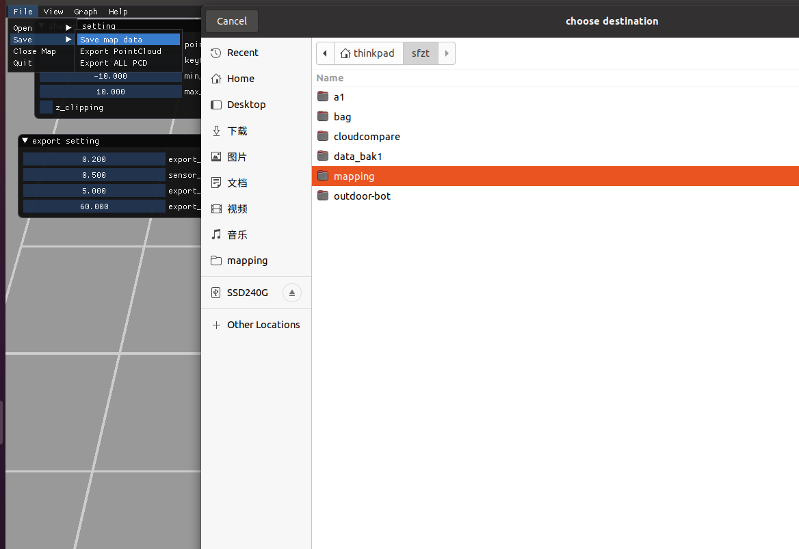