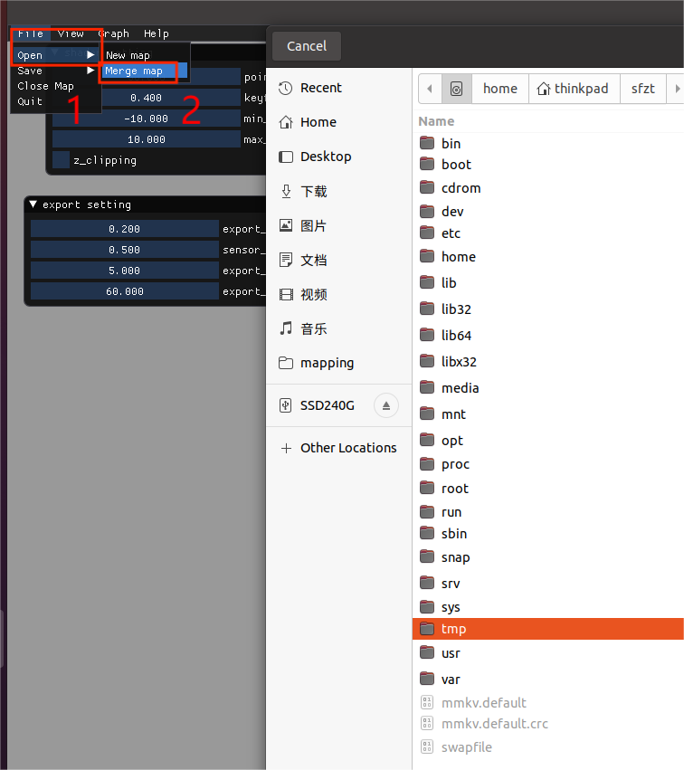
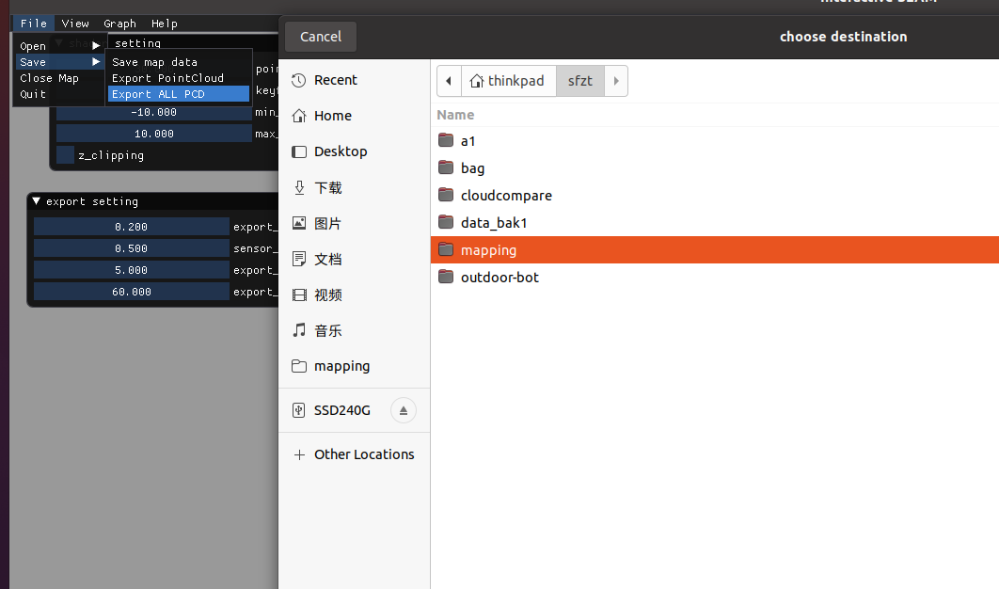
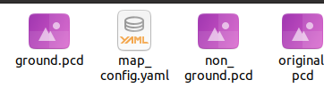

## Requirements

- ROS (tested on Noetic)
- The `sf-mapping` package in the home directory
- Two corrected point cloud files

## Merge Maps 

Two maps may need to be merged if the jigsaw mapping procedure was followed during data collection. First correct the first and second maps separately, and then merge them. First, import the first map, and then import the second map. After importing, correct the same route on the two maps to make them coincide without ghosting. First, use the starting point of the first map to fix the starting point of the second map (the starting point of the second map is the corresponding point of the first map).   

After modification, click File → Save → Export ALL PCD to export four files to the custom directory. 

The four generated files are shown in the following figure. 

