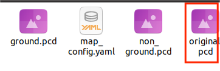
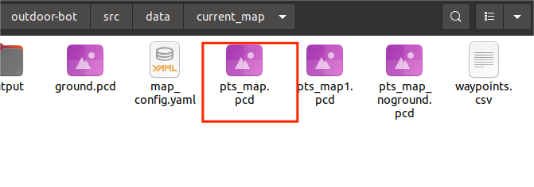
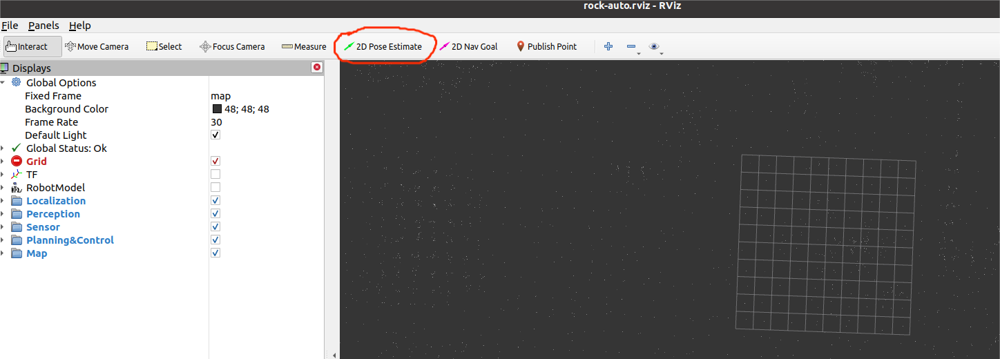
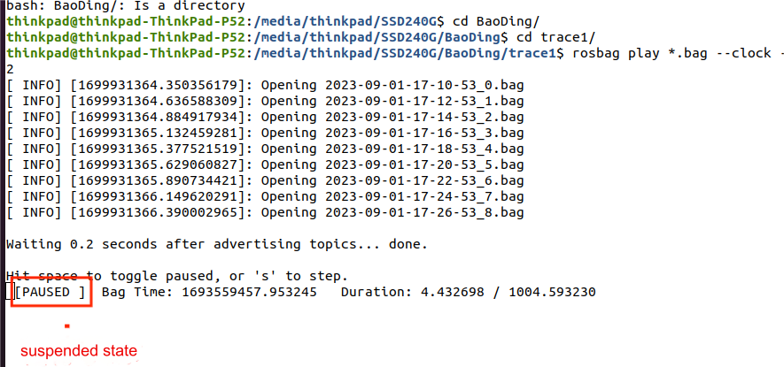

## Requirements

- The full `outdoor-arm` package, in the home directory of your local machine
- The bag file(s) creating during the mapping process
- The corrected (and merged) point cloud files

## Playback packets 

Test whether the repaired map can be used. Run in `rviz` to check if you follow the collected route on the map. If there is any random running, it means the map is not working and needs to be corrected again.

Four files generated by `interactive_slam` are



Place the files circled by the red lines in the `~/outdoor-arm/src/data/current_map` folder and rename them as `pts_map.pcd`, which is the file name circled by the red lines. Use the previous `pts_map.pcd` file as a backup. 



Then input at the terminal 

```
cd ~/outdoor-arm
source devel/setup.bash 
cd src/scripts/ 
./start.sh
```

Second terminal input 

```
rosbag play "path to bag file" --clock -r 2 （2 is a replay of several times the data area, and 1 can also be used）         
```

Open `rviz` again to record the data map, then locate at the starting point. Once the location is successful, you can run the data. Click the green arrow to publish the starting point of the map.



Switch to the terminal running the bag, pause playback by pressing space, and then continue by pressing space.

