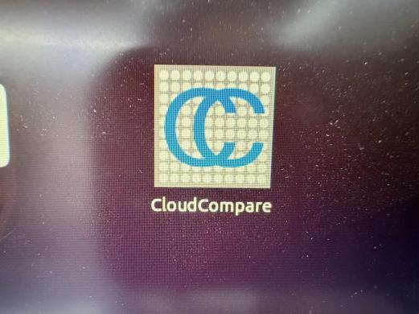
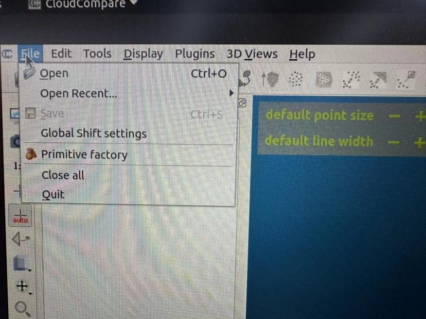
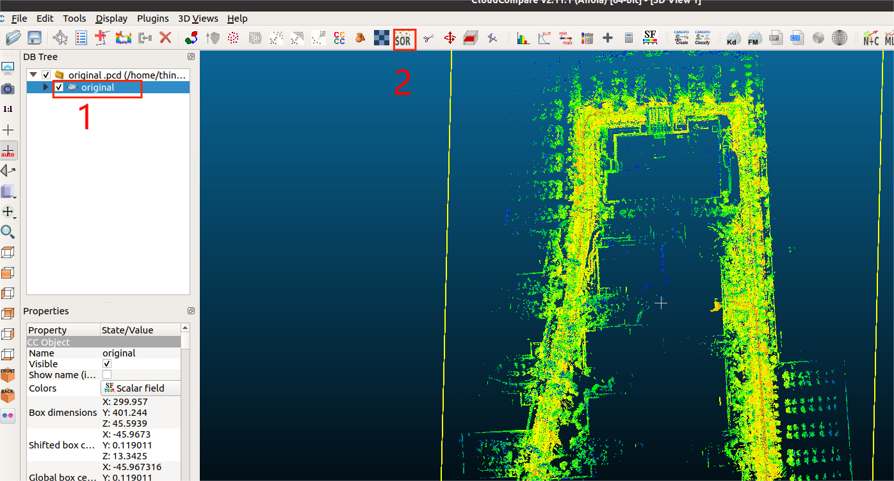
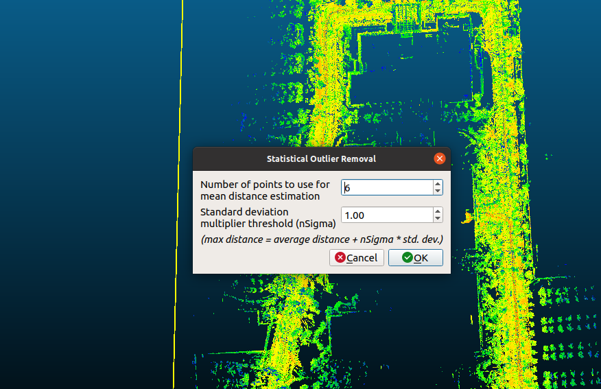
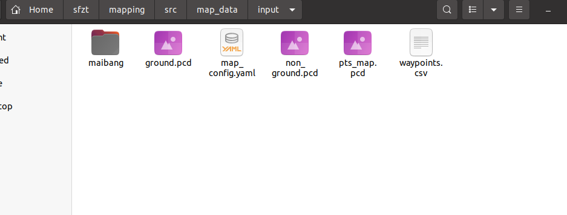
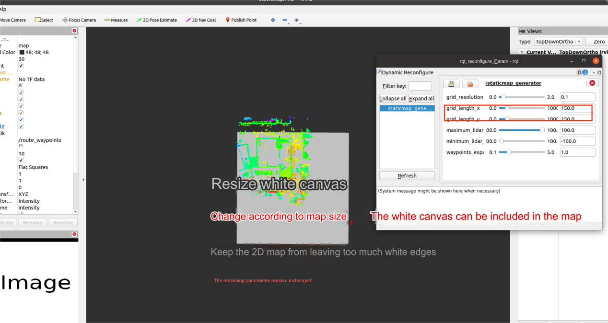
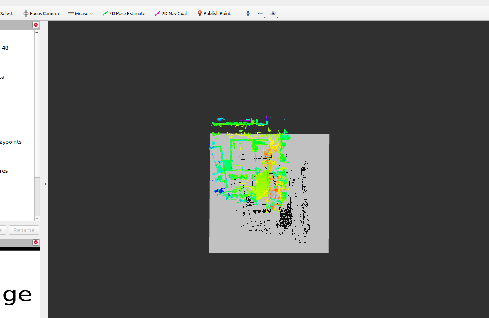
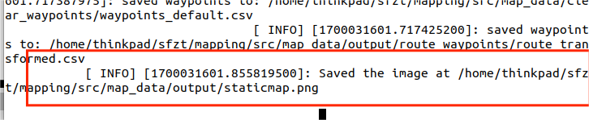

## Requirements

- ROS (tested on Noetic)
- The `CloudCompare` software
- The `sf-mapping` package in the home directory
- The corrected (and merged) point cloud files

## Convert to 2D maps for use and draw restricted areas 

First, open the CloudCompare software



Click File → Open to open the file named `pts_map.pcd` in the file generated by the corrected map.



After opening, select "pts_map" in the left sidebar and then click "SOR".



The following interface appears. Use the parameters in the figure and click OK. Then click "Save" to save the custom directory 



## Generate a 2D plot 

Put the four files generated by Cloud Compare and the waypoint file in the `~/sf-mapping/src/map_data/input` folder 



```
cd ~/sf-mapping/ 
source devel/setup.bash 
rosparam set use_sim_time false
roslaunch staticmap staticmap_saver.launch
```

After opening, adjust the parameters. Grid-resolution is adjusted based on the map, using 0.1 for values less than 100x100 and 0.2 or 0.3 for values greater than 100x100. The sliders for `grid_length_x` and `grild_length_y` are used to adjust the size of the canvas according to the size of the map. They should be adjusted to fit within the map. Do not leave too many white edges on the 2D map, and keep all other parameters unchanged.



After adjusting the parameters, click on "2D Pose Estimate", select the center of the point cloud, and the following interface will appear 



Switch to the terminal startup program interface and save with Shift+S (the save path will appear after pressing Shift+S) 


