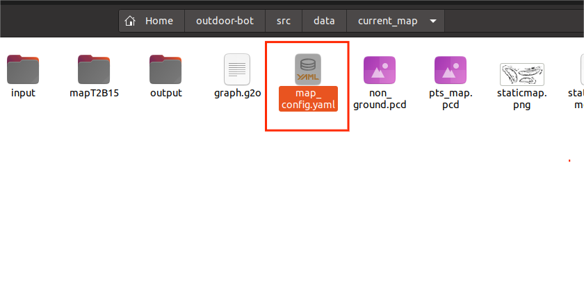
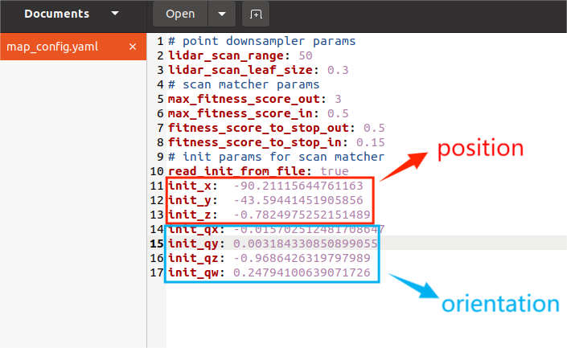
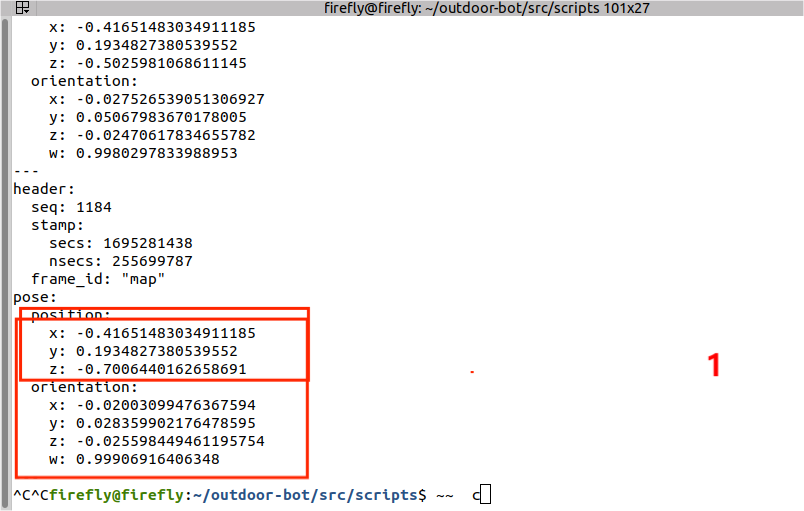
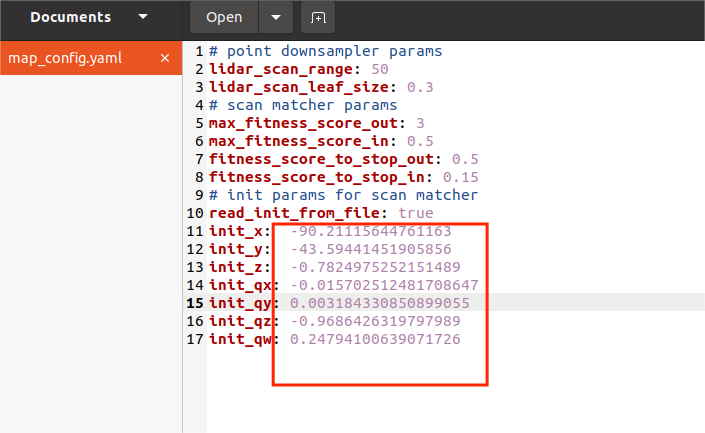

## Requirements

- The delivery vehicle
- ROS (tested on Noetic)
- The full `outdoor-arm` package, in the home directory of the delivery vehicle

### Starting point setting 

Open the selected file in `~/outdoor-arm/src/data/current_map` directory of the delivery vehicle 



The following image shows the opening, and the selected parameter coordinates need to be changed to the coordinates of the starting point. 



Start the following program at the starting point 

The first terminal enters `roscore` to start 

```
roscore 
```

The second terminal enters the main program to start 

```
cd ~/outdoor-arm 
source devel/setup.bash 
cd src/scripts 
./start.sh
```

After the main program is started, it is necessary to locate in `rviz`. If the location is successful, perform the following operations:   

Enter at the third terminal   

```
cd ~/outdoor-arm
source devel/setup.bash 
rostopic echo /ekf_pose
``` 

After starting, it will keep brushing, and it needs to be closed by Ctrl + C.  



Then fill these coordinates in the following figure according to the identification and save them. If you need to change the start point, do the same. Only change the coordinate value. Copy the coordinate data in the terminal to the `map_config.yaml`. 

